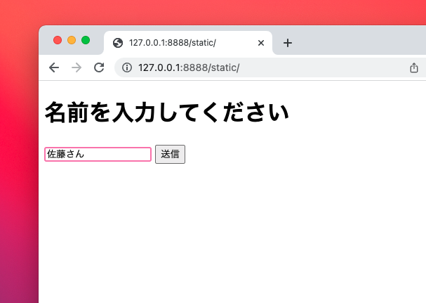
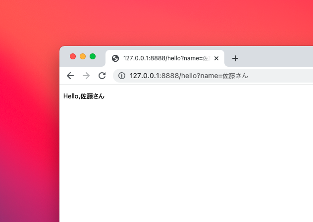

# 挨拶するアプリをGinで作る
## はじめに
各種ファイルを管理したいディレクトリに移動後、ターミナルから
```
$ mkdir gin_lesson && cd gin_lesson
$ go mod init hello_gin
```
go modでプロジェクト初期化をしておきましょう。<br>
v1.7.4のGinをインストール
```
$ go get github.com/gin-gonic/gin@v1.7.4
```
## アプリ概要
HTMLのフォームから名前を入力、そんな前を利用して挨拶を返してくれるアプリ<br>
簡単なやつ。<br>

## HTMLファイル作成
```
.
├── ginLesson.md
├── go.mod
├── go.sum
├── main.go
└── static
    └── index.html
```
staticフォルダを作って、その中にindex.htmlを作ります。<br>
Ginは指定したフォルダ以下のHTMLや画像などのファイルを自動的にブラウザに返してくれるようです。<br>

## Goファイル
```
package main

import (
	"log"
	"net/http"

	"github.com/gin-gonic/gin"
)

func main() {
	router := gin.Default()

  // 自動的にファイルを返すよう設定 --- (*1)
	router.StaticFS("/static", http.Dir("static"))
  // ルートなら /static/index.html にリダイレクト --- (*2)
	router.GET("/", func(ctx *gin.Context) {
		ctx.Redirect(302, "/static/index.html")
	})

  // フォームの内容を受け取って挨拶する --- (*3)
	router.GET("/hello", func(ctx *gin.Context) {
		name := ctx.Query("name")
		ctx.Header("Context-Type", "text/html; charset=UTF-8")
		ctx.String(200, "<h1>Hello,"+name+"</h1>")
	})

  // サーバーを起動
	err := router.Run("127.0.0.1:8888")
	if err != nil {
		log.Fatal("サーバー起動に失敗", err)
	}
}

```

## Goファイルの流れ
`*1`でstatic以下にあるファイルを自動的にブラウザに返信している、<br>
`*2`指定したアドレスにアクセスがあった時に、リダイレクトしている。<br>
今回はルートにアクセスした際に「/static/index.html」にリダイレクトしてHTMLファイルが表示されるようになっている。<br>
`*3`送信ボタンを押したあと、入力されたnameを取得して、動的にHTMLコードを生成し返信している。




## 起動方法
```
$ go run .
```
これで起動します。<br>
あとはブラウザのアドレスバーに指定したアドレス、今回は「127.0.0.1:8888」を入力することでアプリをブラウザ上で使うことができます。